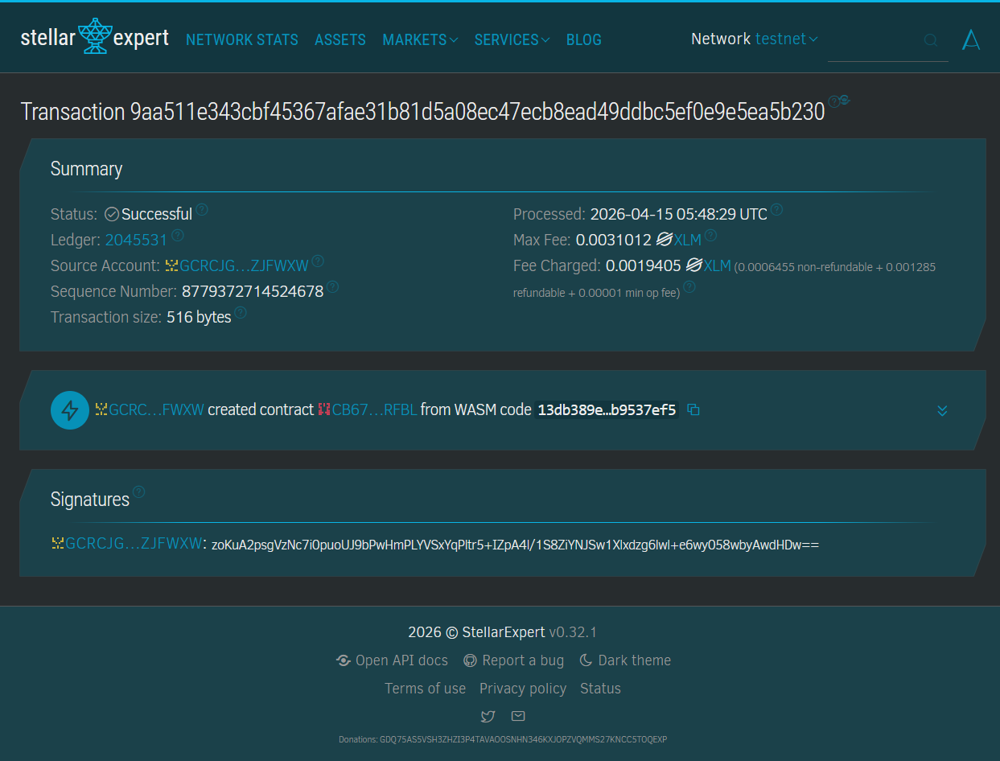
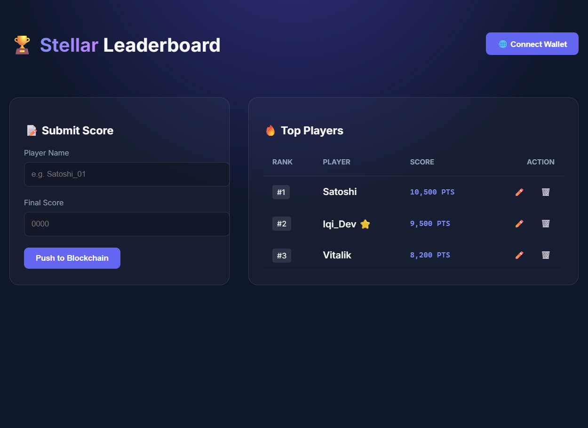

# 🏆 Decentralized Game Leaderboard (DGL)

**Decentralized Game Leaderboard** — A high-performance, blockchain-based scoring system for modern Web3 games built on Stellar.

---

## 📝 Project Description

**Decentralized Game Leaderboard (DGL)** is a robust smart contract solution built on the **Stellar Blockchain** using the **Soroban SDK**. This project moves traditional game scoring systems from centralized databases to a transparent, immutable, and decentralized environment.

Developed as a **Full CRUD (Create, Read, Update, Delete)** application, DGL allows game developers to record player achievements securely. By leveraging Stellar's efficiency, every high score is a permanent record that cannot be manipulated, ensuring fair play and transparency in competitive gaming.

## 🚀 Key Features

* **Immutable High Score Creation**: Record player names and scores directly on the Stellar ledger with unique identification.
* **Real-Time Leaderboard Retrieval**: Fetch the entire leaderboard in a single optimized call, synchronized with the blockchain state.
* **Dynamic Data Management (Update & Delete)**: Modify player records or remove entries (e.g., for anti-cheat purposes) through verified smart contract calls.
* **Minimalist Web3 Frontend**: A clean, professional UI built with **TypeScript** and integrated with **Freighter Wallet**.

## 🛠 Technical Stack

* **Smart Contract**: Rust & Soroban SDK.
* **Frontend**: Vanilla TypeScript & Vite (Responsive Design).
* **Blockchain**: Stellar Network (Testnet).
* **Wallet Integration**: Stellar Freighter API.

## 📊 Contract Details

* **Contract ID**: `CB67TWOEZ3DIZ7MXQDSO5PX2Y4RHAYQ3FMJUJIZCOHHDK62PFWJZRFBL`
* **Network**: Stellar Testnet

### Screenshots

> **1. Stellar Expert Transaction (Contract Deployment)**
> 

> **2. Minimalist Web3 Frontend UI**
> 

*(Note: Please ensure the image filenames match the ones uploaded in your repository)*

## 🔮 Future Scope

1.  **Global Player Ranking**: Implement an Elo-style ranking system across multiple games.
2.  **Reward Integration**: Automatically distribute XLM or custom tokens to top-ranked players.
3.  **Tournament Mode**: Time-locked leaderboards for seasonal gaming events.
4.  **Anti-Cheat Layer**: Integration with ZK-proofs to verify score authenticity.

## 🏁 Getting Started

To interact with the contract via CLI, use the following commands:

**Add a new score:**
```bash
stellar contract invoke --id CB67TWOEZ3DIZ7MXQDSO5PX2Y4RHAYQ3FMJUJIZCOHHDK62PFWJZRFBL --source YOUR_ACCOUNT --network testnet -- add_score --player_name "Iqi" --score 9999